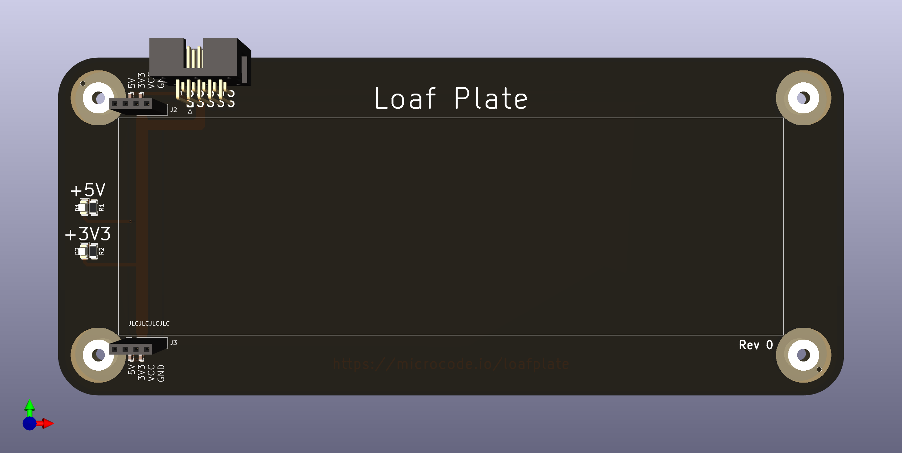
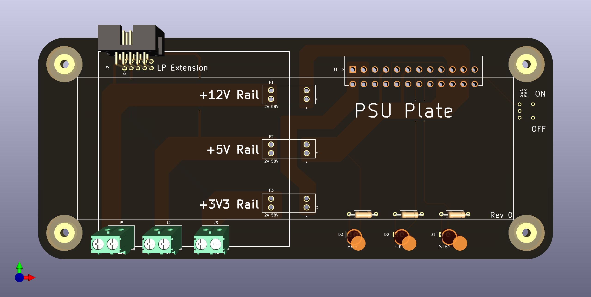
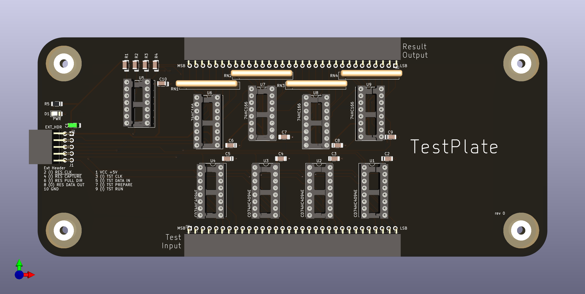
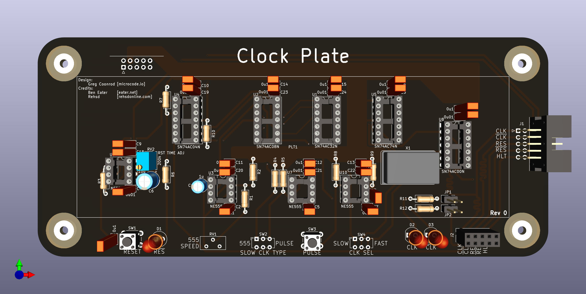

# The LoafPlate

The LoafPlate is a DIY electronics and prototyping tool designed to make interacting with standard
(830 tie-point) breadboards easier. The base PCB is intended to be reused in other designs to allow for the
creation of "plates" (like Arduino shields or RPi hats), which can provide any number of features to support or interact with the LoafPlate and its breadboard.

## The LP Extension

Like the hats and shields that inspired it, the LoafPlate uses a "standard" or shared interface called an LP Extension. The LP Extension is designed to share power, ground, and six GPIO signals between any number of stacked plates. A 10 pin right angle IDC connector with 2.54mm pitch was chosen as it can be used with ribbon cables which are easy for hobbyists to buy or assemble.

Six GPIOs isn't much (not even a full byte!) but unlike an Arduino or Raspberry Pi the LoafPlate is focused
on supporting breadboard prototyping and its design is intended to leave as much open space around the edges of each plate as possible. This space will be used by other plates to provide easy access to sockets, pin headers, screw terminals, buttons, and more.

## The Standard Plates

Along with the LoafPlate, this repo contains designs for a number of other plates which are meant to provide an example of a complete (if simple) circuit prototyping environment or hardware IDE if you will.

### The PSUPlate

All electronics projects need power, as such the first accessory plate for the LoafPlate is the PSUPlate. As the name suggests, it is a power supply unit designed to connect to a common ATX power supply via the 24 pin ATX 2.0 connector. The PSUPlate provides access to 3.3V, 5V, and 12V power rails and uses readily available blade type fuses for circuit protection.

### The TestPlate

Interacting with digital circuits can be difficult and frustrating without tools like an oscilloscope or
logic analyzer. However, those tools can be quite expensive. The TestPlate is designed to act as a circuit
tester, allowing the user to drive two chains of shift registers which allows them to set 32 input values and read 32 output results.

This picture is from an early design of the TestPlate before the LP Extension was finalized.

## Extra Plates

The following are early designs and ideas for kinds of plates that can be created for the LoafPlate environment.

### The ClockPlate

Based on the work of Bed Eater and Rehsd, the ClockPlate is a clock signal generator for 5V logic circuits.
It provides three clocking modes: Manual pulse, Adjustable slow (555), and fixed fast (crystal oscillator). In addition to the standard LP Extension, it exposes two pair of outputs (clock and reset) and accepts a single input (halt).

## Project Goals

I am a software engineer by trade and training. Hardware and digital circuits have always seemed the realm of sorcerers and the dark arts to me. Watching YouTube videos from people like Ben Eater, Rehsd, and Francis Stokes (Low Byte Productions), has really opened my eyes to how accessible hardware and computer design has become. My goal for the LoafPlate project is above all, learning. I want to understand how the computers I write programs for _actually_ work and I want to design circuits, systems, and devices to help further that understanding.

This repo is my RFC, my Request for Comment. Please, point out my mistakes, correct my bad assumptions, suggest improvements, help me _learn_.

### Links & Resources

Tools:

- [KiCad](https://www.kicad.org/): All circuits and PCBs were designed with KiCad V6.

YouTube Creators:

- [Ben Eater](https://www.youtube.com/@BenEater)
- [Rehsd](https://www.youtube.com/@rehsd)
- [Low Byte Productions](https://www.youtube.com/@LowByteProductions)
- [Phil's Lab](https://www.youtube.com/@PhilsLab)
- [Fabian Schuiki](https://www.youtube.com/@fabianschuiki)
- [Adrien Kohlbecker](https://www.youtube.com/@akohlbecker)
